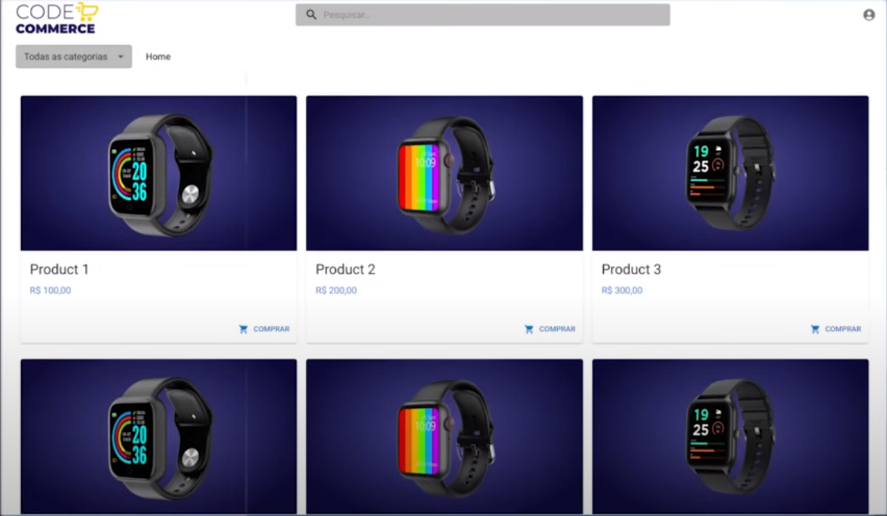
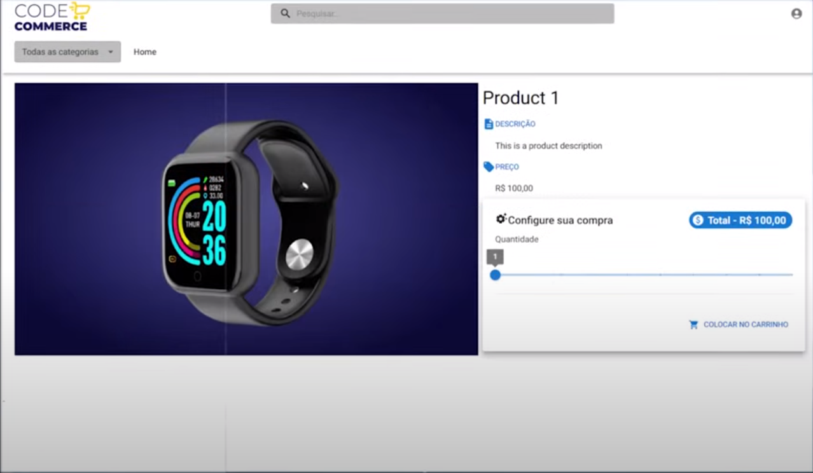
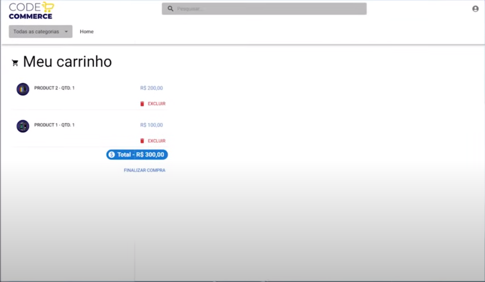
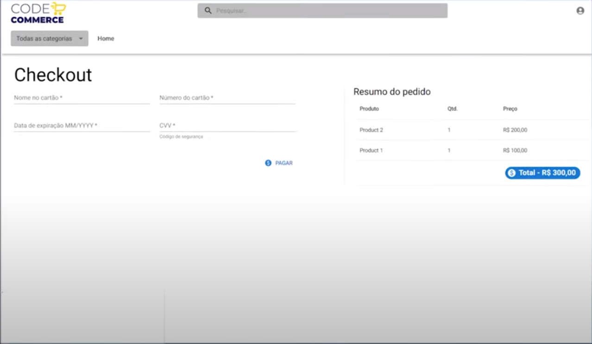
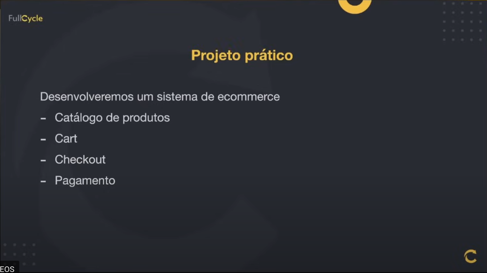
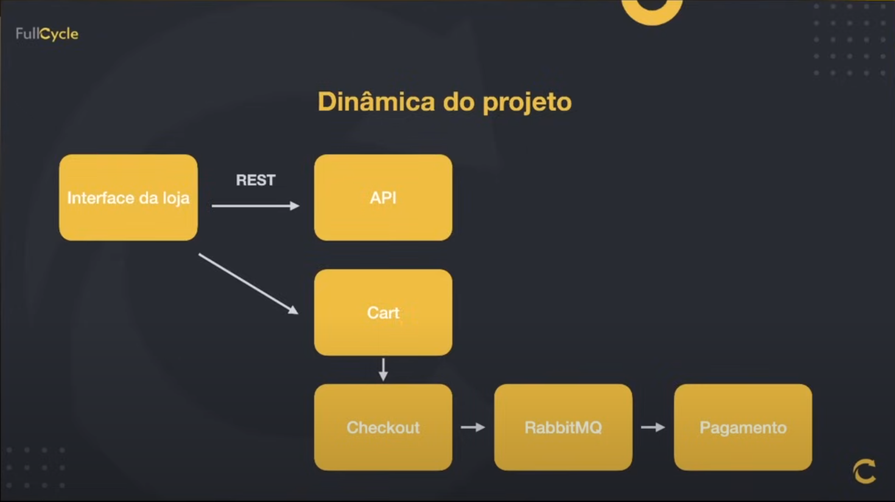
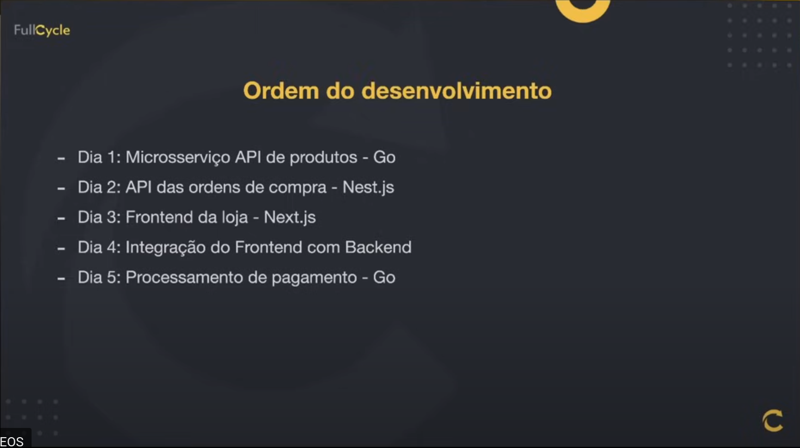

# Imersão FullStack & FullCycle 17 - Code-commerce

> Imersão FullStack & FullCycle 17 da CodeEdu / FullCycle

## Tecnologias

- Go lang
- Nest.js
- Next.js
- RabbitMQ
- Docker

## Telas

## Sobre o Projeto

